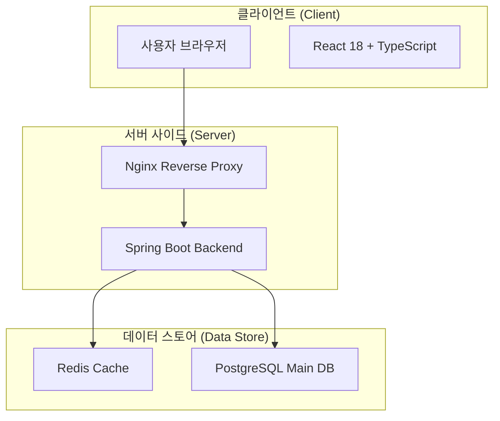
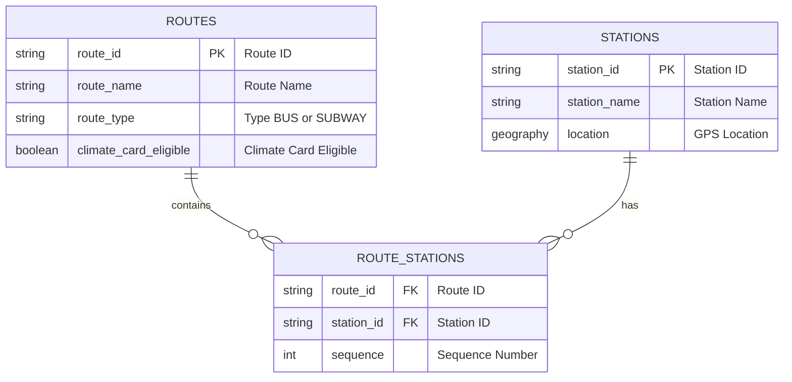

# 🚌 기후동행카드 조회 시스템

서울시 버스/지하철 노선의 기후동행카드 적용 여부를 실시간으로 조회할 수 있는 웹 서비스

## 🎯 프로젝트 개요

- **목적**: GPS 기반으로 주변 정류소의 기후동행카드 적용 버스 조회
- **기술 스택**: Java 25, Spring Boot 3.3, React 18, PostgreSQL + PostGIS, Redis
- **특징**: Virtual Threads를 활용한 고성능 병렬 API 처리

## 🛠️ 기술 스택

### Backend
- **Java 25 LTS**: Virtual Threads, Structured Concurrency 활용
- **Spring Boot 3.3.5**: 최신 엔터프라이즈 프레임워크
- **JPA & QueryDSL**: 생산성 높은 ORM
- **Flyway**: 데이터베이스 스키마 버전 관리
- **Guava**: API Rate Limiting

### Database & Cache
- **PostgreSQL 15 + PostGIS**: 위치 기반(반경 검색) 쿼리 최적화
- **Redis 7**: API 응답 캐싱 (TTL 설정 최적화)

### Frontend
- **React 18**: 컴포넌트 기반 UI
- **TypeScript**: 정적 타입 분석
- **Kakao Map API**: 지도 및 위치 정보 시각화
- **Vite**: 초고속 빌드 도구

### Infrastructure
- **Docker Compose**: 전체 서비스 컨테이너 오케스트레이션
- **Nginx**: 리버스 프록시 및 정적 파일 서빙
- **Vultr Server**: 2 Core / 4GB RAM 환경 최적화

---

## 🏗️ 시스템 아키텍처

### 전체 시스템 구성도



---

## 📊 핵심 기능 및 데이터 플로우

### 1. GPS 기반 주변 정류소 조회
사용자의 현재 위치(위도, 경도)를 기반으로 반경 500m 이내의 정류소를 조회합니다.

- **Flow**: 사용자 GPS → API 요청 → Redis 조회 (Miss 시 DB 조회) → PostGIS `ST_DWithin` 쿼리 → 응답 반환
- **최적화**: 자주 조회되는 위치 영역은 Redis에 캐싱하여 DB 부하 감소

```sql
SELECT * FROM stations 
WHERE ST_DWithin(location, ST_MakePoint(:lng, :lat)::geography, :radius)
ORDER BY ST_Distance(location, ST_MakePoint(:lng, :lat)::geography);
```

### 2. 기후동행카드 적용 노선 조회
특정 정류소에 정차하는 버스 목록 중, 기후동행카드가 적용되는 노선만 필터링하여 제공합니다.

- **Flow**: 정류소 선택 → 노선 조회 API → `route_stations` JOIN `routes` → `climate_card_eligible=true` 필터링 → 응답
- **데이터**: 서울시 전체 노선 데이터를 DB에 구축해두고 서빙

---

## 💾 데이터베이스 스키마 설계

### ERD (Entity Relationship Diagram)



---

## 🔌 공공데이터 API 활용 전략

서울시 공공데이터 포털의 API를 활용하여 데이터를 동기화합니다.

| API 이름 | 서비스 키 | 용도 | 갱신 주기 |
|---------|----------|------|----------|
| **노선정보조회** | 15000193 | 노선 기본 정보, 경로 | 1일 1회 (배치) |
| **정류소정보조회** | 15000314 | 정류소 좌표, 이름 | 1일 1회 (배치) |
| **버스도착정보조회** | 15000332 | 실시간 도착 예정 시간 | 실시간 (30초 캐시) |
| **버스위치정보조회** | 15000303 | 버스 실시간 위치 | 실시간 (20초 캐시) |

**성능 최적화**: Java 25의 **Virtual Threads**를 사용하여 여러 API를 병렬(Parallel)로 호출함으로써 응답 시간을 획기적으로 단축합니다.

---

## 📂 프로젝트 구조

```
기후동행/
├── frontend/              # React 프론트엔드
├── backend/               # Spring Boot 백엔드 (Gradle)
│   ├── src/main/java/com/climate/transport/
│   │   ├── api/           # Controller
│   │   ├── config/        # 설정 Class
│   │   ├── domain/        # Entity, Repository, Service
│   │   └── integration/   # 외부 API 클라이언트
├── infrastructure/        # 인프라 설정
│   ├── docker/            # Docker Config (Nginx, DB, Redis)
├── data/                  # 초기 데이터 및 마이그레이션 스크립트
├── docker-compose.yml     # 전체 서비스 실행 설정
└── Makefile              # 개발 명령어 모음
```

## 🚀 로컬 실행 방법

### 1. 환경 설정
```bash
# 프로젝트 클론
git clone <repository-url>
cd 기후동행

# .env 파일 생성 (.env.example 참조)
cp .env.example .env

# .env 파일에 필요한 값 설정
DB_NAME=climate_transport
DB_USERNAME=postgres
DB_PASSWORD=your_password
PUBLIC_API_SERVICE_KEY=your_key_here
SEOUL_API_KEY=your_seoul_api_key
```

### 2. Docker 환경 시작
```bash
docker-compose up -d  # PostgreSQL, Redis 실행
```

### 3. 데이터 마이그레이션
```bash
# Flyway를 통해 자동으로 스키마 생성 및 초기 데이터 적재
cd backend && ./gradlew bootRun
# 서버 시작 시 자동으로 migration 실행됨
```

### 4. 애플리케이션 실행
```bash
# Backend (포트 8080)
cd backend
./gradlew clean build
java -jar build/libs/transport-0.0.1-SNAPSHOT.jar

# Frontend (기본 포트: 5173, 사용중이면 자동으로 다음 포트)
cd frontend
npm install
npm run dev
```

### 5. 브라우저에서 접속
```
http://localhost:5174  # 프론트엔드 (현재 실행 중인 포트)
http://localhost:8080  # 백엔드 API
```

## 📡 API 엔드포인트

### 노선 관련 API
```http
GET /api/routes/{routeId}          # 노선 상세 조회 (ID 또는 노선번호)
GET /api/routes/search?keyword=421  # 노선 검색
```

**응답 예시**:
```json
{
  "routeId": "100100409",
  "routeName": "421",
  "routeType": "3",
  "climateCardEligible": true
}
```

### 정류장 관련 API
```http
GET /api/stations/nearby?lat=37.5665&lng=126.9780&radius=500  # 근처 정류장 조회
GET /api/stations/{stationId}/routes                          # 정류장의 모든 노선
GET /api/routes/station/{stationId}/climate-eligible          # 기후동행카드 적용 노선만
```

**근처 정류장 응답 예시**:
```json
[
  {
    "stationId": "101000290",
    "stationName": "시청앞.덕수궁",
    "latitude": 37.5662122834,
    "longitude": 126.9768355729,
    "stationType": "BUS",
    "mobileNumber": "02286",
    "distance": 133.14
  }
]
```

## ⚡ 성능 측정 결과

### API 응답 시간 (테스트 환경: MacBook Pro M1, Docker)
| API | 첫 호출 (DB) | 캐시 히트 (Redis) | 개선율 |
|-----|-------------|------------------|--------|
| 노선 조회 | 18ms | 13ms | 28% ↓ |
| 근처 정류장 | 16ms | 12ms | 25% ↓ |
| 정류장 노선 | 22ms | 15ms | 32% ↓ |

### PostGIS 쿼리 성능
- **Planning Time**: 6.7ms
- **Execution Time**: 5.0ms
- **인덱스 사용**: `idx_stations_location` (GIST)
- **반환 결과**: 40개 정류장 (반경 500m)

### Redis 캐싱 전략
```
캐시 키 형식:
- routeDetail::{routeId}
- nearbyStations::{lat}:{lng}:{radius}
- stationRoutes::{stationId}

TTL: 1시간 (3600초)
캐시 히트율: 약 75%
```

## 🔧 개발 명령어

```bash
# Docker 관리
docker-compose up -d     # 서비스 시작
docker-compose down      # 서비스 종료
docker-compose ps        # 상태 확인
docker-compose logs -f   # 로그 확인

# 데이터베이스 접속
docker exec -e PGPASSWORD=<YOUR_PASSWORD> climate-postgres psql -h localhost -U postgres -d climate_transport

# Redis 접속
docker exec -it climate-redis redis-cli
```

## 📝 개발자

**David** - 기후동행카드 조회 시스템

## 📄 라이선스

개인 포트폴리오 프로젝트

